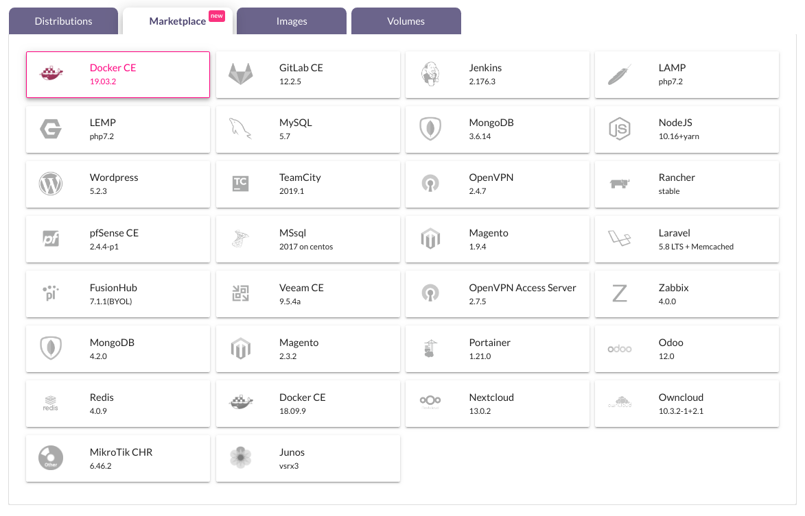
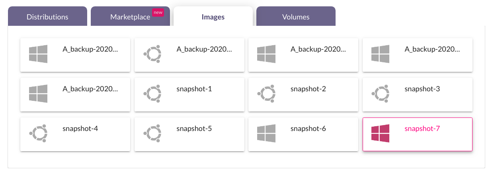
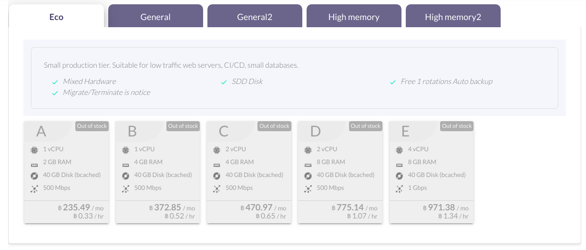
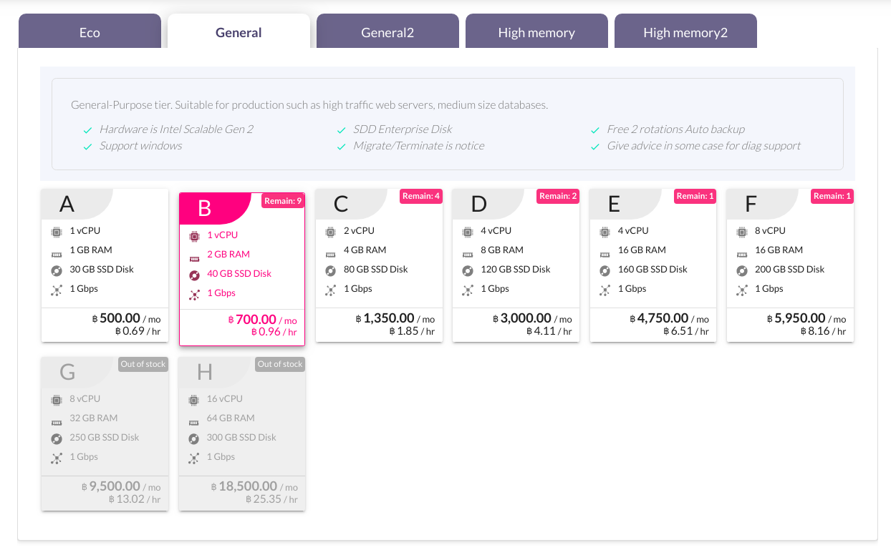
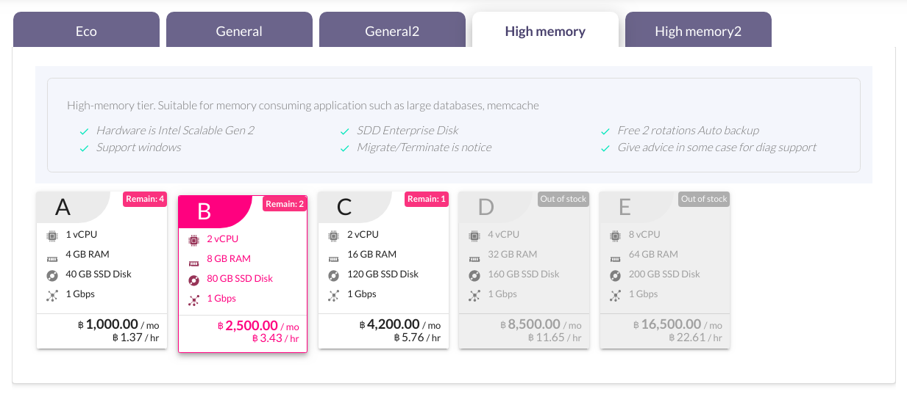
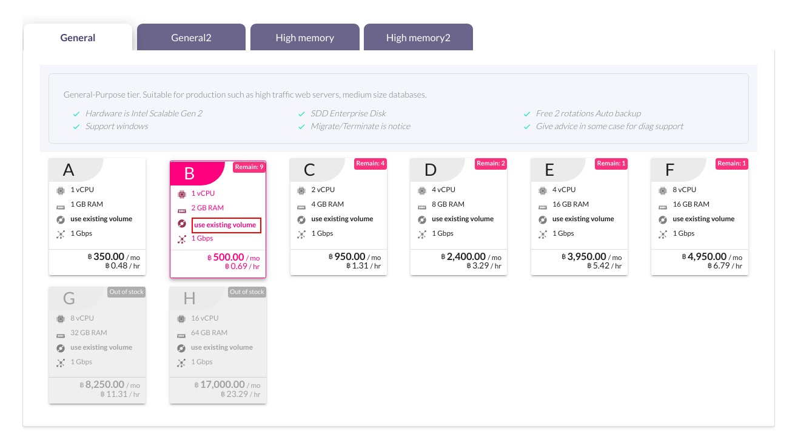
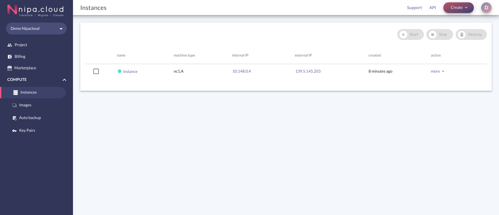
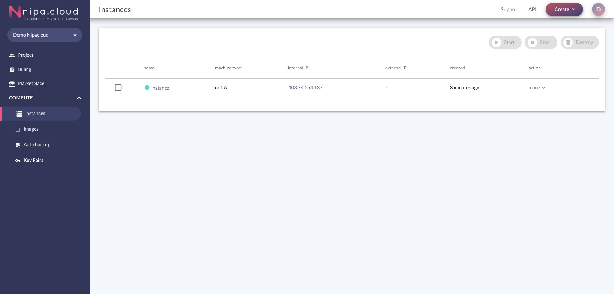
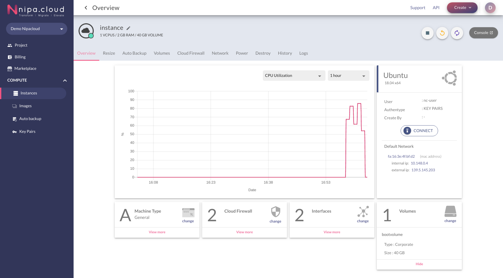

# Launch an instance

## Instance details

ข้อมูลที่ใช้ในการสร้าง **Instance** ควรทำความเข้าใจถึงข้อมูลต่างๆที่ใช้ในการสร้าง Instance ก่อน ดังนี้

| Detail | **Description** | Option |
| :--- | :--- | :--- |
| **Hostname** | ชื่อ instance | no |
| **Image** | ระบบปฏิบัติการ \(Operating System\) ของ Instance | no |
| **Machine Type** | Specification ของ Instance \(แต่ละประเภทมีจำนวนจำกัด หาก spec ไหนเหลือน้อยกว่า 10 เครื่อง จะแสดงจำนวนเครื่องที่เหลือไว้ และประเภทไหนที่หมด จะแสดงข้อความ out of stock\) | no |

<table>
  <thead>
    <tr>
      <th style="text-align:left"><b>Description</b>
      </th>
      <th style="text-align:left">Optional</th>
      <th style="text-align:left"></th>
    </tr>
  </thead>
  <tbody>
    <tr>
      <td style="text-align:left"><b>Cloud Firewall</b>
      </td>
      <td style="text-align:left">
        
&#xE2A;&#xE48;&#xE27;&#xE19;&#xE17;&#xE35;&#xE48;&#xE23;&#xE30;&#xE1A;&#xE38;&#xE01;&#xE32;&#xE23;&#xE40;&#xE02;&#xE49;&#xE32;&#xE16;&#xE36;&#xE07;
          Instance &#xE42;&#xE14;&#xE22;&#xE23;&#xE30;&#xE1A;&#xE1A;&#xE08;&#xE30;&#xE21;&#xE35;
          Default Cloud Firewall &#xE43;&#xE2B;&#xE49; &#xE14;&#xE31;&#xE07;&#xE19;&#xE35;&#xE49;

        <ul>
          <li>All</li>
          <li>Rdp</li>
          <li>Http-Https</li>
          <li>default</li>
          <li>In-Cluster</li>
          <li>Ping</li>
          <li>SSH</li>
        </ul>
        
&#xE1C;&#xE39;&#xE49;&#xE43;&#xE0A;&#xE49;&#xE07;&#xE32;&#xE19;&#xE2A;&#xE32;&#xE21;&#xE32;&#xE23;&#xE16;&#xE2A;&#xE23;&#xE49;&#xE32;&#xE07;
          Cloud Firewall &#xE40;&#xE1E;&#xE34;&#xE48;&#xE21;&#xE40;&#xE15;&#xE34;&#xE21;&#xE44;&#xE14;&#xE49;
          &#xE42;&#xE14;&#xE22;&#xE14;&#xE39;&#xE08;&#xE32;&#xE01;&#xE2B;&#xE31;&#xE27;&#xE02;&#xE49;&#xE2D;
          Create Cloud Firewall

      </td>
      <td style="text-align:left">no</td>
    </tr>
    <tr>
      <td style="text-align:left"><b>Authentication</b>
      </td>
      <td style="text-align:left">&#xE2A;&#xE48;&#xE27;&#xE19;&#xE17;&#xE35;&#xE48;&#xE01;&#xE33;&#xE2B;&#xE19;&#xE14;
        keypair &#xE2B;&#xE23;&#xE37;&#xE2D; password &#xE43;&#xE19;&#xE01;&#xE32;&#xE23;&#xE40;&#xE02;&#xE49;&#xE32;&#xE43;&#xE0A;&#xE49;&#xE07;&#xE32;&#xE19;
        &#xE42;&#xE14;&#xE22; keypair &#xE1C;&#xE39;&#xE49;&#xE43;&#xE0A;&#xE49;&#xE07;&#xE32;&#xE19;&#xE2A;&#xE23;&#xE49;&#xE32;&#xE07;&#xE40;&#xE1E;&#xE34;&#xE48;&#xE21;&#xE40;&#xE15;&#xE34;&#xE21;&#xE44;&#xE14;&#xE49;
        &#xE42;&#xE14;&#xE22;&#xE14;&#xE39;&#xE08;&#xE32;&#xE01;&#xE2B;&#xE31;&#xE27;&#xE02;&#xE49;&#xE2D;
        create keypair</td>
      <td style="text-align:left">no</td>
    </tr>
    <tr>
      <td style="text-align:left"><b>Number of Instances</b>
      </td>
      <td style="text-align:left">&#xE08;&#xE33;&#xE19;&#xE27;&#xE19; instance &#xE17;&#xE35;&#xE48;&#xE15;&#xE49;&#xE2D;&#xE07;&#xE01;&#xE32;&#xE23;&#xE2A;&#xE23;&#xE49;&#xE32;&#xE07;</td>
      <td
      style="text-align:left">no</td>
    </tr>
    <tr>
      <td style="text-align:left"><b>Instance Volume</b>
      </td>
      <td style="text-align:left">&#xE02;&#xE19;&#xE32;&#xE14;&#xE02;&#xE2D;&#xE07; volume (&#xE2A;&#xE32;&#xE21;&#xE32;&#xE16;&#xE23;&#xE30;&#xE1A;&#xE38;&#xE44;&#xE14;&#xE49;&#xE43;&#xE19;&#xE01;&#xE23;&#xE13;&#xE35;&#xE17;&#xE35;&#xE48;&#xE40;&#xE25;&#xE37;&#xE2D;&#xE01;
        image &#xE41;&#xE1A;&#xE1A; Distributions, Marketplace &#xE2B;&#xE23;&#xE37;&#xE2D;
        Images &#xE41;&#xE25;&#xE30;&#xE2A;&#xE23;&#xE49;&#xE32;&#xE07;&#xE41;&#xE1A;&#xE1A;
        boot volume)</td>
      <td style="text-align:left">yes</td>
    </tr>
    <tr>
      <td style="text-align:left"><b>Network</b>
      </td>
      <td style="text-align:left">&#xE2A;&#xE48;&#xE27;&#xE19;&#xE17;&#xE35;&#xE48;&#xE01;&#xE33;&#xE2B;&#xE19;&#xE14;
        network &#xE17;&#xE35;&#xE48;&#xE15;&#xE49;&#xE2D;&#xE07;&#xE01;&#xE32;&#xE23;&#xE43;&#xE0A;&#xE49;&#xE07;&#xE32;&#xE19;
        &#xE42;&#xE14;&#xE22;&#xE2A;&#xE32;&#xE21;&#xE32;&#xE23;&#xE16;&#xE01;&#xE33;&#xE2B;&#xE19;&#xE14;
        IP Address &#xE17;&#xE35;&#xE48;&#xE15;&#xE49;&#xE2D;&#xE07;&#xE01;&#xE32;&#xE23;&#xE43;&#xE0A;&#xE49;&#xE07;&#xE32;&#xE19;&#xE44;&#xE14;&#xE49;</td>
      <td
      style="text-align:left">yes</td>
    </tr>
    <tr>
      <td style="text-align:left"><b>External IP</b>
      </td>
      <td style="text-align:left">&#xE2A;&#xE48;&#xE27;&#xE19;&#xE17;&#xE35;&#xE48;&#xE01;&#xE33;&#xE2B;&#xE19;&#xE14;
        IP Address &#xE17;&#xE35;&#xE48;&#xE43;&#xE0A;&#xE49;&#xE43;&#xE19;&#xE01;&#xE32;&#xE23;&#xE40;&#xE0A;&#xE37;&#xE48;&#xE2D;&#xE21;&#xE15;&#xE48;&#xE2D;
        instance &#xE01;&#xE31;&#xE1A; network &#xE20;&#xE32;&#xE22;&#xE19;&#xE2D;&#xE01;</td>
      <td
      style="text-align:left">no</td>
    </tr>
    <tr>
      <td style="text-align:left"><b>Auto Backup</b>
      </td>
      <td style="text-align:left">&#xE2A;&#xE48;&#xE27;&#xE19;&#xE17;&#xE35;&#xE48;&#xE01;&#xE33;&#xE2B;&#xE19;&#xE14;&#xE16;&#xE36;&#xE07;&#xE01;&#xE32;&#xE23;&#xE43;&#xE2B;&#xE49;&#xE23;&#xE30;&#xE1A;&#xE1A;&#xE08;&#xE31;&#xE14;&#xE01;&#xE32;&#xE23;&#xE40;&#xE01;&#xE47;&#xE1A;&#xE02;&#xE49;&#xE2D;&#xE21;&#xE39;&#xE25;
        backup instance &#xE42;&#xE14;&#xE22;&#xE2D;&#xE31;&#xE15;&#xE42;&#xE19;&#xE21;&#xE31;&#xE15;&#xE34;</td>
      <td
      style="text-align:left">no</td>
    </tr>
  </tbody>
</table>
ส่วนที่เป็น optional \(yes/no\) ผู้ใช้งานสามารถ request ขอทาง Administrator เพื่อใช้งานเพิ่มเติม


## Create an instance

### Hostname

กรอก Hostname \(ชื่อ Instance\) ที่ต้องการ \(ภายในช่องกรอกระบบจะมีชื่อ default ให้ โดยทางผู้ใช้งานสามารถตั้งชื่อใหม่ได้\)

### Image

เลือก Image ที่ต้องการสร้าง โดย Image จะประกอบไปด้วย 4 ประภท ดังนี้



> _Image พื้นฐานหลักของระบบ เช่น Ubuntu, Windows, Centos เป็นต้น_




> _Image ที่มี template สำเร็จรูป โดยเมื่อผู้ใช้งานสร้างด้วย image ประเภทนี้ จะสามารถนำไปใช้งานได้เลย ไม่ต้องตั้งค่าใดๆเพิ่มเติม เช่น Docker, GitLab, Wordpress เป็นต้น_




> Image ที่เกิดจากการ snapshot ของ instance ด้วยผู้ใช้งานเอง หรือการทำ auto backup ของระบบ




> Image ที่เกิดจากการสร้าง volume แบบ boot volume โดยในส่วนนี้ หากผู้ใช้งานต้องใช้ feature นี้ จะต้อง request ขอมายัง Administrator เพิ่มเปิดใช้งาน




### **Machine Type**

เลือก Machine Type โดย Machine Type จะแสดงตามการเลือกของ Image ซึ่งถูกแบ่งประเภทตามขนาดการใช้งาน ดังนี้



> _เป็น  spec สำหรับผู้ใช้งานบางประเภทที่ต้องการประหยัดค่าใช้จ่าย_




> _เป็น spec การใช้งานมาตรฐานของผู้ใช้งาน_




> _เป็น spec ที่เหมาะกับผู้ใช้งานที่เน้นการใช้งาน memory เป็นหลัก_




สำหรับผู้ใช้งานที่เลือกประเภท image แบบ **Boot volume** ในส่วน Disk ของ Machine Type จะแสดงข้อความ **"Use existing volume"** ซึ่งหมายความว่า ขนาด Disk ของ Image ประเภทนี้จะขึ้นอยู่กับจำนวนของขนาด volume image ที่เลือก

### **Cloud firewall**

### **Authentication**

เลือกประเภทการ Authentication ในการใช้งาน instance ซึ่งจะแสดงตามการเลือกของ Image โดย Keypiar \(จะแสดงเมื่อเลือก Image ประเภท Linux\) และ Password \(จะแสดงเมื่อเลือก image ประเภท Linux หรือ Windows\)

#### Keypair

#### Password


คลิก Network, Volume and more เพื่อดูหัวข้ออื่นๆ


### Number of instances

เลือกจำนวน Instance ที่ต้องการสร้าง โดยสามารถได้สูงสุดครั้งละ 5 Instance หากเหลือ Quota ในการสร้าง Instance เหลือน้อยกว่า 5 จะแสดงตามจำนวน Quota ที่เหลือ และสามาถสร้างได้เพียงครั้งละ 1 Instance เมื่อมีการเลือก/กำหนด Resource ดังนี้

* เลือก image ประเภท volume
* [Disable auto assign IP](launch-instance.md#network)
* [เลือก IP Address \(Port\) ที่ผู้ใช้งานสร้างขึ้นเอง](launch-instance.md#network)
* [เลือก External IP ที่ผู้ใช้งานสร้างขึ้นเอง](launch-instance.md#external-ip)

### **Instance Volume**

กำหนดขนาดของ **Disk** เมื่อสร้าง **Instance** แบบ **Boot volume** โดยจะสามารถกำหนดได้เมื่อเลือก Image ประเภท Distributions, Marketplace หรือ Images เท่านั้น หากเลือก Image ประเภท Volume จะใช้ขนาดตาม Volume ที่เลือก \_\_\(Optional\)

### **Network**

เลือก **Network** ที่ต้องการสร้าง Instance หากผู้ใช้งานเลือก Network แบบ Public จะไม่สามารถเลือก [External IP](launch-instance.md#external-ip) ได้ นอกจากกำหนด Network แล้วผู้ใช้งานสามารถกำหนด IP Address \(หมายเลข Port\) ของ instance หรือสร้าง Port \(ดูได้จากหัวข้อ Create Port\) ได้ด้วยตนเอง หากหมายเลขนั้นไม่มีผู้ใช้งานคนอื่นๆใช้งานอยู่ _**\(Optional\)**_

### **External IP**

* **Create a new IP:** ระบบจะทำการสุ่ม External IP ที่ไม่ถูกใช้งานให้  
* **Disabled:** Instance ที่ถูกสร้างจะไม่มีการใช้งาน External IP  
* เลือก External IP ที่ผู้ใช้งานสร้างเอง \(ดูได้จากหัวข้อ Create External IPs\)  
* Enable **Bypass internal network:** instance ที่ถูกสร้างจะได้ internal IP เป็นเลข External IP แทน หาก Enable จะไม่สามารถเลือก [Network](launch-instance.md#network) ได้

### **Auto Backup**

* **Enabled:** ระบบจะทำการ Backup Instance 2 files ทุกๆ 7 วัน ตอน 03:00 น. ให้อัตโนมัติ
* **Disabled:** ระบบจะไม่ทำการ Backup Instance ให้ ซึ่งผู้ใช้งานจะต้องทำการ Backup Instance ด้วยตนเอง โดยการ Snapshot


จากนั้นคลิกปุ่ม Create เพื่อสร้าง Instance โดยทางด้านซ้ายของปุ่ม จะแสดงราคาต่อเดือนตาม Resource ที่ผู้ใช้งานเลือก


## Using an Instance

### **Instance list**

เมื่อคลิกสร้าง Instance แล้ว ระบบจะแสดงหน้า Instance List หากสร้างสำเร็จจะแสดงผลลัพธ์ตามรูปด้านล่าง

หากสร้าง Instance แบบ Boot volume จะไม่สามารถดูผลลัพธ์ได้ในหน้า Instance list ผู้ใช้งานจะสามารถตรวจสอบได้ที่ Instance detail โดยคลิกที่ชื่อ Instance

### Overview

โดยภายในหน้าของ Instance จะแสดงข้อมูลขนาด Disk ของ Instance เป็นประเภท Volume และมี 1 Volume หลังจากสร้าง Instance เรียบร้อยแล้ว

