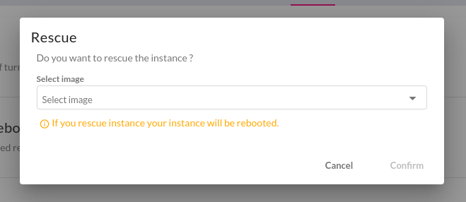
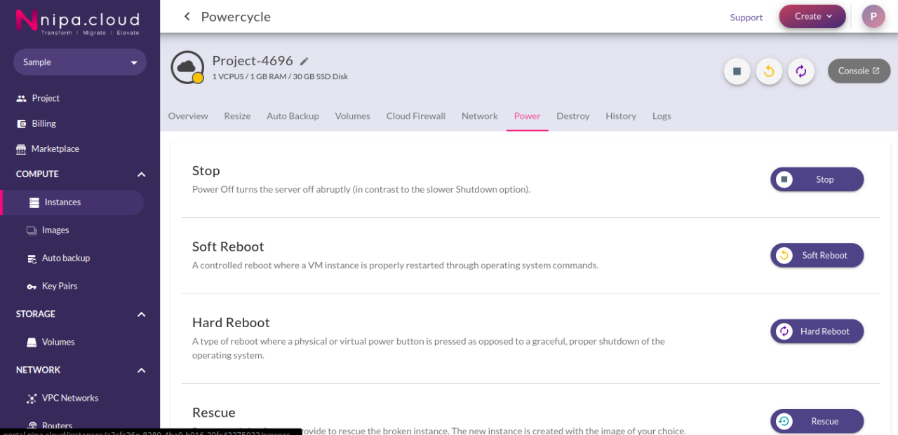
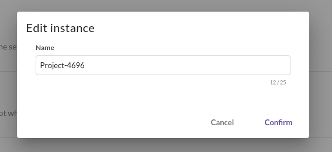

# Instance Operation

### Stop

เมื่อไม่ต้องการใช้งาน instance แต่ยังไม่ต้องการลบ instance ตัวนั้นทั้ง หรือต้องการทำ operation อื่นๆ ที่ทำได้เฉพาะตอนที่ instance อยู่ในสถานะ shutoff สามารถทำการ shutoff instance ด้วยคำสั่ง stop ได้ โดยมีขั้นตอนดังนี้

1. เมื่อ Login เข้ามาใน NCP จะพบกับ instance page ให้เลือก instance ที่ต้องการ stop

2. ที่ instance detail page ให้เลือกที่ power tab เพื่อเข้าสู่ power page

3. ที่ power page ให้กดปุ่ม stop เพื่อเข้า stop instance page

4. กดที่ปุ่ม "Confirm" เพื่อ stop instance 

### Start 

เมื่อต้องการกลับมาใช้งาน instance ที่อยู่ในสถานะ shutoff ทำได้โดยการสั่ง start instance โดยมีขั้นตอนดังนี้

1. เมื่อ Login เข้ามาใน NCP จะพบกับ instance page ให้เลือก instance ที่ต้องการ start

2. ที่ instance detail page ให้เลือกที่ power tab เพื่อเข้าสู่ power page

3. กดที่ปุ่ม Start เพื่อเข้า start instance page

4. กดที่ปุ่ม Confirm เพื่อเริ่มใช้งาน instance

### Soft Reboot

เมื่อต้องการ reboot instance ด้วย command ของ OS สามารถทำได้โดยการสั่ง soft reboot โดยมีขั้นตอนดังนี้

1. เมื่อ Login เข้ามาใน NCP จะพบกับ instance page ให้เลือก instance ที่ต้องการทำ soft reboot

2. ที่ instance detail page ให้เลือกที่ power tab เพื่อเข้าสู่ power page

3. กดที่ปุ่ม Soft Reboot เพื่อเข้าสู่ soft reboot page

4. กดที่ปุ่ม Confirm เพื่อเริ่มการ soft reboot ระบบจะใช้เวลาสักครู่หนึ่ง เมื่อเสร็จแล้วจะเห็นจุดสีเขียว แสดงสถานะ active ของ instance

### Hard Reboot

เมื่อต้องการ reboot instance ที่ตัวเครื่อง physical สามารถทำได้โดยการสั่ง hard reboot โดยมีขั้นตอนดังนี้

1. เมื่อ Login เข้ามาใน NCP จะพบกับ instance page ให้เลือก instance ที่ต้องการทำ hard reboot

2. ที่ instance detail page ให้เลือกที่ power tab เพื่อเข้าสู่ power page

3. กดที่ปุ่ม Hard Reboot เพื่อเข้าสู่ hard reboot page

4. กดที่ปุ่ม Confirm เพื่อเริ่มการ hard reboot ระบบจะใช้เวลาสักครู่หนึ่ง เมื่อเสร็จแล้วจะเห็นจุดสีเขียว แสดงสถานะ active ของ instance

### Rescue

เมื่อ instance เกิดปัญหากับ OS ทำให้เข้าใช้งานไม่ได้ แต่ต้องการเข้าไปกู้ข้อมูลที่อยู่ภายใน สามารถทำได้โดยการสั่ง rescue โดยคำสั่งนี้ ระบบจะทำการ mount OS เปล่าเข้าไป เพื่อให้สามารถเข้าถึงข้อมูลภายใน instance ได้ โดยมีขั้นตอนดังนี้

1. เมื่อ Login เข้ามาใน NCP จะพบกับ instance page ให้เลือก instance ที่ต้องการทำ rescue

2. กดที่ปุ่ม Rescue เพื่อเข้า rescue page

3. ที่ Select image ให้เลือก image ที่ต้องการใช้ในการ mount เพื่อ rescue instance นี้ แล้วกดที่ปุ่ม Confirm เพื่อเริ่มทำ mount image ที่เลือกเข้าไปที่ instance ระบบจะใช้เวลาซักครู่นึง เมื่อเสร็จแล้วจะเห็นจุดสีเหลืองแสดงสถานะ rescue ของ instance

4. เข้าใช้งาน instance ได้ตามปกติ ผ่าน rescue OS ที่ mount ลงไป

### Clean Install

เมื่อใช้งาน instance ไปได้ซักพักนึง ก็อาจเกิดปัญหาบางอย่างขึ้น ที่ไม่สามารถแก้ไขได้ หรือแก้ไขได้ยาก การสร้าง instance ใหม่ตั้งแต่ต้นเลยอาจจะดีกว่า แต่ก็จะต้องเสียเวลาย้าย IP, Port, Network, ฯลฯ ที่เคยใช้งานใน instance ตัวเดิม ไปยัง instance ตัวใหม่อีก ทางออกนึงของปัญหานี้ก็คือการใช้ feature clean install ที่จะเป็นการล้าง instance ให้กลับไปเป็นเหมือนตอนสร้างขึ้นมาใหม่นั่นเอง โดยมีขั้นตอนดังนี้

1. เมื่อ Login เข้ามาใน NCP จะพบกับ instance page ให้เลือก instance ที่ต้องการทำ clean install

2. stop instance ตามวิธีการด้านบน [Instance Operation](instance-operation.md#stop)

3. ที่ power page ด้านล่าง จะพบปุ่ม clean install

4. กดที่ปุ่ม Clean install เพื่อเข้า clean install page

5. กดที่ปุ่ม "Confirm" เพื่อเริ่มทำ clean install ระบบจะใช้เวลาซักครู่นึง เมื่อเสร็จแล้วจะเห็นจุดสีเทาแสดงสถานะของ instance

6. start instance ตามวิธีด้านบน [Instance Operation](instance-operation.md#start)

### Rebuild

เมื่อเราต้องการเปลี่ยน OS ของ instance หรือต้องการ instance ที่มี image ตัวอื่น แต่ด้วย config, spec, IP, port, network, ฯลน เดิม เราไม่จำเป็นจะต้อง launch instance ขึ้นมาใหม่แล้ว setting ใหม่ทั้งหมด เราสามารถใช้ feature rebuild เพื่อ build image ใหม่ ไปที่ instance ตัวเดิมได้ โดยมีขั้นตอนดังนี้

1. เมื่อ Login เข้ามาใน NCP จะพบกับ instance page ให้เลือก instance ที่ต้องการทำ clean install

2. stop instance ตามวิธีการด้านบน [Instance Operation](instance-operation.md#stop)

3. ที่ power page ด้านล่าง จะพบปุ่ม rebuild

4. กดที่ปุ่ม Rebuild เพื่อเข้า rebuild page

5. ที่ Select image ให้เลือก image ใหม่ที่ต้องการ build ลงไปใน instance นี้ แล้วกดที่ปุ่ม Confirm เพื่อเริ่มทำ rebuild ระบบจะใช้เวลาซักครู่นึง เมื่อเสร็จแล้วจะเห็นจุดสีเทาแสดงสถานะของ instance

6. start instance ตามวิธีด้านบน [Instance Operation](instance-operation.md#start)

### Edit Name

เมื่อเราต้องการเปลี่ยนชื่อของ Instance เพื่อให้ง่ายต่อการจดจำ สามารถทำได้ตามขั้นตอนต่อไปนี้

1. เมื่อ Login เข้ามาใน NCP จะพบกับ instance page ให้เลือก instance ที่ต้องการเปลี่ยนชื่อ

2. คลิกที่ชื่อของ instance ที่อยู่ด้านบนของ page เพื่อเข้าสู่ edit name page

3. ที่ช่อง Name ใส่ชื่อใหม่ที่ต้องการตั้งให้ instance นี้ แล้วกดที่ปุ่ม Confirm เพื่อทำการเปลี่ยนชื่อ instance ระบบจะพากลับไปที่ instance detail page และแสดงให้เห็นชื่อ instance ที่เปลี่ยนไป

### Destroy Instance

เมื่อเราไม่ต้องการ instance แล้ว ก็ควรทำการลบทิ้ง เพื่อไม่ให้ระบบเก็บเงินต่อไป โดยมีขั้นตอนดังนี้

1. เมื่อ Login เข้ามาใน NCP จะพบกับ instance page ให้เลือก instance ที่ต้องการลบ

2. ที่ instance detail page ให้เลือกที่ destroy tab เพื่อเข้าสู่ destroy page

3. กดที่ปุ่ม Destroy เพื่อเข้าสู่ confirm destroy page

4. ในการลบ instance เราสามารถลบ external IP ที่ผูกอยู่กับ instance ตัวนี้ไปด้วยได้ โดยการเช็คที่ Remove External IP หรือหากต้องการเก็บไว้ ให้เอาเช็คออก ก่อนกด Confirm เพื่อทำการลบ instance 


เมื่อทำการลบ instance แล้ว จะไม่สามารถู้คืนได้อีก หากต้องการเก็บข้อมูลใน instance เอาไว้ ให้ลองศึกษาที่การ Create Snapshot เพื่อบันทึก state ของ instance เอาไว้ 


