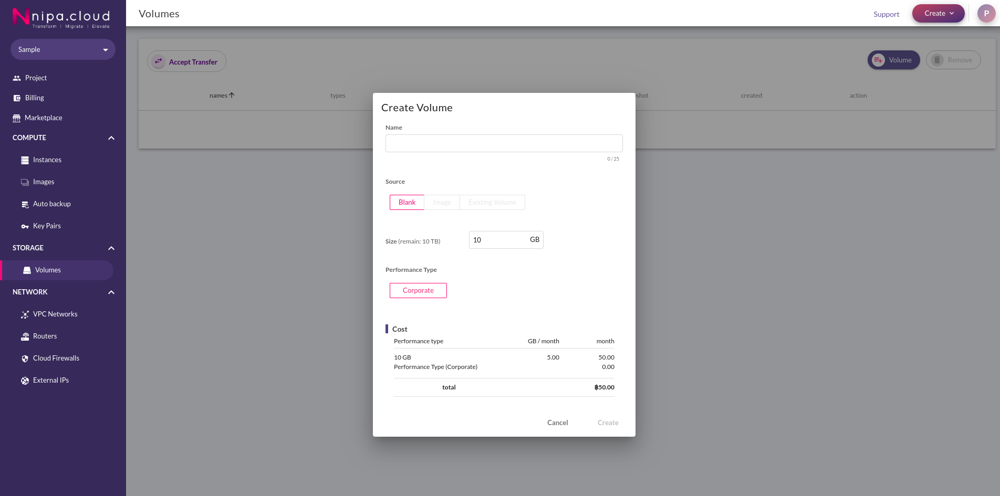
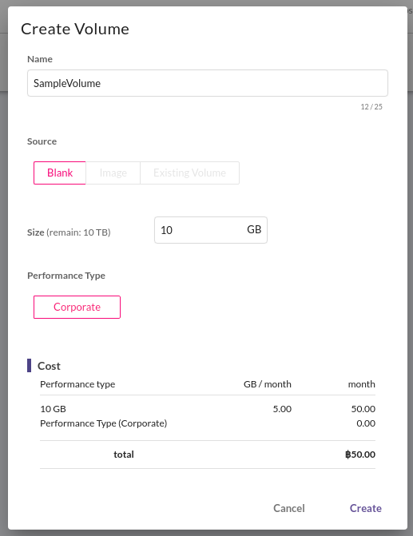
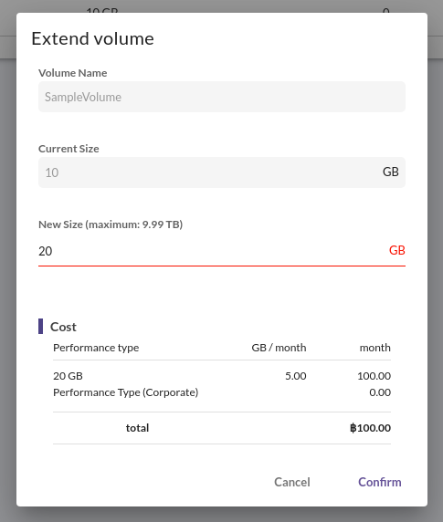
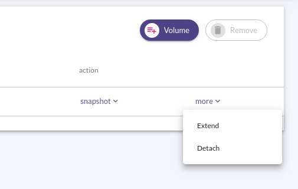
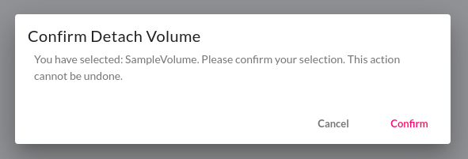
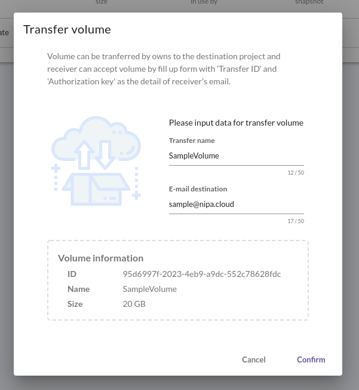
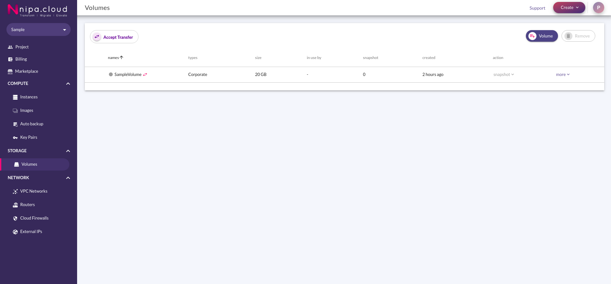
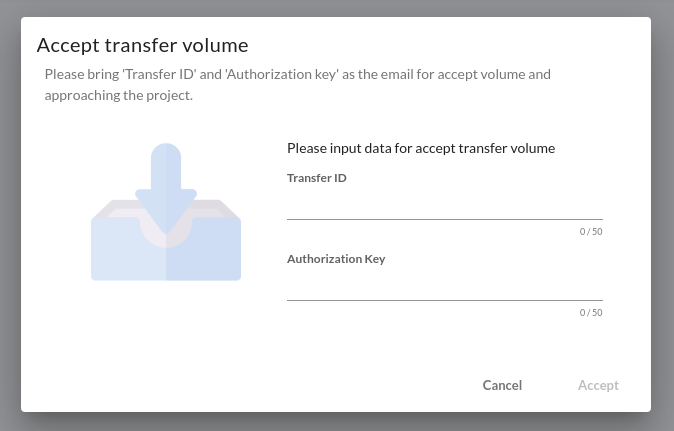

# Volumes Management

### Create Volume

การสร้าง Volume เพื่อใช้เป็น storage เพิ่มเติมให้กับ instance โดยมีขั้นตอนในการสร้างดังนี้

1. เมื่อ Login เข้ามาใน NCP ให้คลิกที่ Volumes ภายใต้กลุ่ม Storage ที่ sidebar เพื่อเข้าสู่ volume page

2.  คลิกปุ่ม Volume ที่บริเวณด้านขวาบนของ page เพื่อเข้าสู่ create volume page

3. ที่ create volume page ให้ใส่ข้อมูลดังต่อไปนี้

* Name: ชื่อของ volume
* Source: สร้าง volume ตัวนี้จากอะไร มีให้เลือก 3 แบบ ดังต่อไปนี้
  * Blank:  สร้าง volume ธรรมดา
  * Image: สร้าง volume จาก image
  * Existing Volume: สร้าง volume จาก volume ที่มีอยู่
* Size: ขนาดของ volume
* Perfomance Type: ชนิดของ volume โดยจะมีให้เลือกแค่ corporate เท่านั้น

4. ตรวจสอบข้อมูลให้ถูกต้องแล้วกดปุ่ม "Confirm" เพื่อสร้าง volume ระบบจะพากลับไปที่ volumes page พร้อมแสดง volume ที่ถูกสร้าง

### Extend Volume

เมื่อสร้าง volume ขึ้นมาแล้ว แต่มีขนาดไม่เพียงพอต่อการใช้งาน สามารถขยายขนาดได้ด้วยการ extend ซึ่งมีขั้นตอนดังนี้

1. ที่ Volume page ให้กดปุ่ม more ที่ด้านขวาของ volume ที่ต้องทำการ extend

2. กดที่ปุ่ม Extend เพื่อเข้า extend volume page

3. ที่ Extend volume page ให้ใส่ข้อมูลดังต่อไปนี้

* Volume Name: ชื่อของ volume ที่ต้องการ extend
* Current size: ขนาดปัจจุบันของ volume
* New size: ขนาดใหม่ที่ต้องการ

4. ตรวจสอบข้อมูลให้ถูกต้องแล้วกดปุ่ม "Confirm" เพื่อ extend volume ระบบจะพากลับไปที่ volumes page พร้อมแสดง volume ที่ถูก extend แล้ว

### Attach Volume

เมื่อมี Volume ตามขนาดที่ต้องการแล้ว ก็ต้องเอาไปใช้ โดยการ attach เข้ากับ instance โดยมีขั้นตอนดังนี้

1.  เมื่อ login เข้ามาใน NCP ให้คลิกที่ Volumes ภายใต้กลุ่ม Storage ที่ sidebar เพื่อเข้าสู่ volume page

2. กดที่ปุ่ม Attach เพื่อเข้า attach volume page

3. เลือกชื่อของ instance ที่ต้องการ attach volume เข้าไป

4. ตรวจสอบข้อมูลให้ถูกต้องแล้วกดปุ่ม "Confirm" เพื่อ attach volume ระบบจะพากลับไปที่ volumes page พร้อมแสดง Volume ที่ถูก attach แล้ว

### Detach Volume

เมื่อต้องการสลับ Volume ไปใส่ไว้ที่ Instance อื่น หรือต้องการลบ volume จะต้องทำการ Detach ก่อน โดยมีขั้นตอนดังนี้

1.  เมื่อ Login เข้ามาใน NCP ให้คลิกที่ Volumes ภายใต้กลุ่ม Storage ที่ sidebar เพื่อเข้าสู่ volume page

2. กดที่ปุ่ม Detach เพื่อเข้า detach volume page

4. ตรวจสอบข้อมูลให้ถูกต้องแล้วกดปุ่ม "Confirm" เพื่อ detach volume ระบบจะพากลับไปที่ volumes page พร้อมแสดง volume ที่ถูก detach แล้ว

### Transfer Volume

นอกจากเราจะใช้ volume เป็น storage เพิ่มเติมกับ instance ของเราเองได้แล้ว เรายังสามารถ transfer volume ของเราไปให้ project ได้อีกด้วย โดยมีขั้นตอนดังนี้

1.  เมื่อ login เข้ามาใน NCP ให้คลิกที่ Volumes ภายใต้กลุ่ม Storage ที่ sidebar เพื่อเข้าสู่ volume page

2. กดที่ปุ่ม Transfer เพื่อเข้า transfer volume page

3. ที่ transfer volume page ให้ใส่ข้อมูลดังต่อไปนี้

* Transfer Name: ชื่อของการ transfer นี้
* E-mail Destination: email ของผู้รับ volume

4. ตรวจสอบข้อมูลให้ถูกต้องแล้วกดปุ่ม "Confirm" เพื่อ transfer volume หลังจากนั้นระบบจะทำการส่ง email ข้อมูลที่จำเป็นต้องใช้ในการรับ transfer volume ไปให้ และจะแสดงข้อมูลให้สามารถ download เก็บไว้ได้ด้วย

5.  ตรวจสอบข้อมูลให้ถูกต้องและ dowload หากต้องการ เรียบร้อยแล้วแล้วกดปุ่ม "Close" ระบบจะพากลับไปที่ volumes page พร้อมแสดง volume ที่อยู่ในสถานะรอการรับ transfer ซึ่งจะยังคงใช้งานได้ จนกว่าผู้รับจะทำการ accept transfer

### Accept Volume Transfer

หลังจากได้รับ email volume transfer แล้ว สามารถทำการ accept ได้ ตามขั้นตอนต่อไปนี้

1. เมื่อได้รับข้อมูลการ volume transfer มา โดยจะต้องประกอบด้วย Transfer ID และ Authorization Key 


**ตัวอย่างข้อมูล**

     **Transfer ID**: f9045302-9dcb-4473-b88e-6ad5ed86eb66

     **Transfer Name**: sample

     **Authorization Key**: 63f85bb5b3b20385


2. เมื่อ login เข้ามาใน NCP ให้คลิกที่ Volumes ภายใต้กลุ่ม Storage ที่ sidebar เพื่อเข้าสู่ volume page

3. กดที่ปุ่ม Accept Transfer เพื่อเข้าสู่ accept transfer volume page

4. ที่ accept transfer volume page ให้ใส่ข้อมูลตามที่ได้รับมาทาง email หรือทางอื่นๆ

5. ตรวจสอบข้อมูลให้ถูกต้องแล้วกดปุ่ม Accept เพื่อ accept volume ระบบจะพากลับไปที่ volumes page พร้อมแสดง volume ที่ได้รับมา

